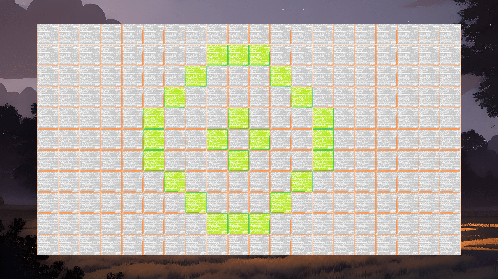

# Game Of Life

## About

The Game Of Life project is a simple, fully interactive cellular automaton, written in C++. It uses OpenCL technology to distribute work across devices and is capable of visualizing cells with the use of SFML library.

## Authors

- Piotr Kowalski

## Dependencies

This project uses the following external libraries and software:
- _SFML_ is under zlib/png license, available at: https://www.sfml-dev.org/
- _OpenAL-Soft_ is under the LGPL license, available at: http://openal-soft.org/
- _OpenCL_ is distributed under a number of different licenses, currently applicable license by Khronos can be found in relevant OpenCL header files
- _stb_image_ and _stb_image_write_ are public domain
- _freetype_ is under the FreeType license or the GPL license
- _libogg_ is under the BSD license
- _libvorbis_ is under the BSD license
- _libflac_ is under the BSD license
- _minimp3_ is under the CC0 license

## Features

- interactive board displaying current cell states
- changing cell states by simply clicking them on the board
- changing board size
- changing cell update speed
- simulation pause

## Controls
- _left mouse button_ - set cell state
- _left shift_ - speed up
- _left alt_ - slow down
- _spacebar_ - pause/resume
- _right arrow_ - add column
- _down arrow_ - add row
- _left arrow_ - remove column
- _up arrow_ - remove row
- _Escape_ - exit application

## Images

All the images in the project have been AI-generated with the use of StarryAI: https://starryai.com/

## Music

The music used in the project is:
- _February Night_ by William_King, available on: https://pixabay.com/pl/music/acoustic-group-february-night-193416/, under license: https://pixabay.com/service/terms/ (similar to CC0)

## Gallery

